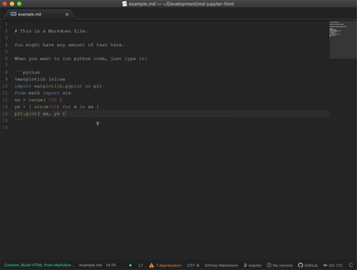

# Goal

In RStudio, while editing an .Rmd file, a single keystroke runs
knitr and displays the compiled version, with code chunks run,
output displayed, and Markdown typeset, next to the source.

I'd like such a UX for any Jupyter-supported language.

This file solves that problem.

# Requirements

This tiny piece of work combines excellent tools made by tons
of other people.  Here's what you need:

 1. [The Atom editor]( https://atom.io)
 2. Atom's [build package]( https://atom.io/packages/build)
 3. Atom's [browser-plus package]( https://atom.io/packages/browser-plus)
 4. [Jupyter]( https://github.com/jupyter/nbconvert#readme) installed and in your path
 5. [Jupytext]( https://github.com/mwouts/jupytext#command-line-conversion) installed and in your path

# Installation

 1. Drop the `.atom-build.js` file from this repository into the
    same folder as the `.md` file(s) you're editing in Atom.
    It defines a custom build process that Atom will notice.
 2. Invoke build (Ctrl/Cmd+B) from within a `.md` file in Atom.

Atom will compile it to HTML (running the code chunks along the
way) and show you the result to the right of your source,
refreshing the view if needed.

# License

